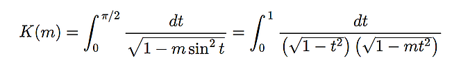
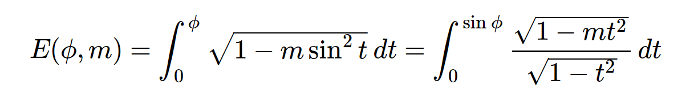
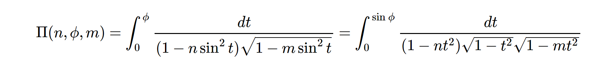

## Complete Elliptic Functions

- `elliptick(m)`

    
     |       the complete elliptic integral of the first kind            |
     |:-----------------------------------------------------------------:|
     |       |

- `elliptice(m)`

     |       the complete elliptic integral of the second kind           |
     |:-----------------------------------------------------------------:|
     |       |

- `ellipticpi(n, m)`

     |       the complete elliptic integral of the third kind            |
     |:-----------------------------------------------------------------:|
     |     |

   
## Incomplete Elliptic Functions

- `ellipticf(phi, m)`

     |       the incomplete elliptic integral of the first kind           |
     |:------------------------------------------------------------------:|
     |        |

- `elliptice(phi, m)`

     |       the incomplete elliptic integral of the second kind          |
     |:------------------------------------------------------------------:|
     |        |

- `ellipticpi(n, phi, m)`

     |       the incomplete elliptic integral of the third kind          |
     |:------------------------------------------------------------------:|
     |        |

## Carlson's Symmetric Elliptic Functions

- `ellipticrf(x, y, z)`

     |       the symmetric elliptic integral of the first kind            |
     |:------------------------------------------------------------------:|
     |      |

- `ellipticrg(x, y, z)`

     |       the symmetric elliptic integral of the second kind          |
     |:------------------------------------------------------------------:|
     |        |

- `ellipticrj(x, y, z, p)`

     |       the symmetric elliptic integral of the third kind          |
     |:------------------------------------------------------------------:|
     |        |

## Jacobi's Theta Functions

## Weierstrass's elliptic functions

(images from the Arb C library docs)
