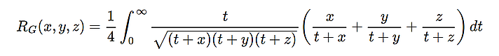

## [complete](http://arblib.org/acb_elliptic.html#complete-elliptic-integrals) 

- the complete elliptic integral of the first kind

    - `elliptic_k(m)`
    - `elliptic_k2(m) == elliptic_k(m^2)`

- the complete elliptic integral of the second kind

    - `elliptic_e(m)`
    - `elliptic_e2(m) == elliptic_e(m^2)`

        
- the complete elliptic integral of the third kind

    - `elliptic_pi(n, m)`
    - `elliptic_pi2(n, m) == elliptic_pi(n, m^2)`

----

## [incomplete](http://arblib.org/acb_elliptic.html#legendre-incomplete-elliptic-integrals)

- the incomplete elliptic integral of the first kind

    - `elliptic_f(phi, m)`
    - `elliptic_f2(phi, m) == elliptic_f(phi, m^2)`

- the incomplete elliptic integral of the second kind

    - `elliptic_e(phi, m)`
    - `elliptic_e2(phi, m) == elliptic_e(phi, m^2)`

        
- the incomplete elliptic integral of the third kind

    - `elliptic_pi(n, phi, m)`
    - `elliptic_pi2(n, phi, m) == elliptic_pi(n, phi, m^2)`

----

## [symmetric (Carlson)](http://arblib.org/acb_elliptic.html#carlson-symmetric-elliptic-integrals)

- the symmetric elliptic integral of the first kind
    
    - `elliptic_rf(x, y, z)`

- the symmetric elliptic integral of the second kind
    
    - `elliptic_rg(x, y, z)`

- the symmetric elliptic integral of the third kind
    
    - `elliptic_rj(x, y, z)`

