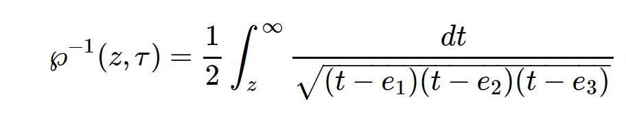
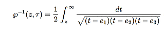

# ArbNumerics

- ArbNumerics.jl offers efficient mathematical computation with multiprecision values

- Floating Point values, Real values (as interval enclosures) and Complex values are supported

- Set the precision to a given number of bits (24..8000) or to cover a number of digits (10..2400)

- Many mathematical functions are available

- Some basic matrix functions are supported

- A Julian perspective on Frederik Johansson's [Arb C library](http://arblib.org/)

# image test

----

-----

-----

-----

-----
